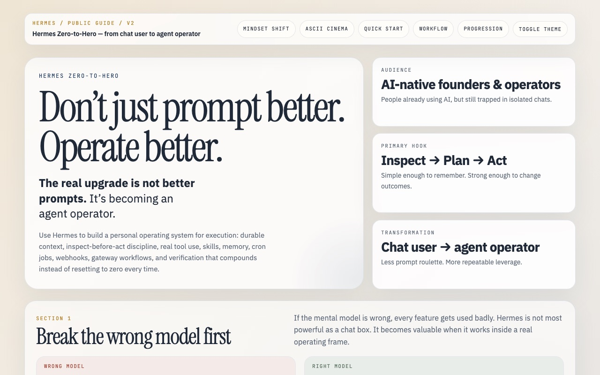

# Hermes Zero-to-Hero

A static, bilingual (English and Turkish) visual guide to operating [Hermes Agent](https://github.com/NousResearch/hermes-agent) from the terminal.

[](LICENSE)
[](LICENSE-CODE)

**Live site:** <https://hermes-guide.neurabytelabs.com> ([English](https://hermes-guide.neurabytelabs.com/en/), [Türkçe](https://hermes-guide.neurabytelabs.com/tr/))



## Why

Most people use an agent like a chat box: one prompt, one answer, start over. The guide describes a different loop: inspect the current state, plan a change, act with real tools, and keep what worked. It walks through setup (`hermes setup`, `hermes doctor`, `hermes model`), memory and skills, the messaging gateway, scheduled jobs, MCP servers, and an animated ASCII walkthrough.

The guide is unofficial and not affiliated with Nous Research.

## Quick start

The site is plain HTML with no build step and no dependencies.

```bash
git clone https://github.com/neurabytelabs/hermes-guide.git
cd hermes-guide
python3 -m http.server 8000
# open http://localhost:8000/en/
```

Or build the container that serves the live site:

```bash
docker build -t hermes-guide .
docker run --rm -p 8080:80 hermes-guide
# open http://localhost:8080/en/
```

## How it works

Each page is a single self-contained HTML file with its own CSS and JavaScript. The `Dockerfile` copies the repository into an `nginx:alpine` image, which serves it as-is.

| Path | Content |
|------|---------|
| `index.html` | Language selector |
| `en/index.html` | English guide |
| `tr/index.html` | Turkish guide |
| `voice-to-knowledge/index.html` | ASCII animation companion page |
| `Dockerfile` | `nginx:alpine` image that serves the files |
| `docs/` | README screenshot |

## Status / limits

- Published. Commands were checked against Hermes Agent v0.21.5 (2026-09-24) on 2026-10-06. Hermes changes quickly; newer versions may rename or change commands.
- The English and Turkish pages are maintained by hand as separate files, so an edit to one has to be copied to the other.
- No automated tests or link checks.

## License

- Text and written content: [CC BY 4.0](LICENSE). Reuse is allowed with attribution, a link to the license, and a note of any changes.
- Code (HTML, CSS and JavaScript in the pages, `Dockerfile`): [MIT](LICENSE-CODE).

Author: [Mustafa Saraç](https://twitter.com/0xsarac), [NeuraByte Labs](https://neurabytelabs.com).

---

## Türkçe

Hermes Agent'ı terminalden kullanmak için hazırlanmış, statik ve iki dilli (İngilizce, Türkçe) görsel rehber. [Hermes Agent](https://github.com/NousResearch/hermes-agent) için resmi olmayan bir rehberdir; Nous Research ile bağlantısı yoktur.

**Durum:** yayında. Komutlar 2026-10-06'da Hermes Agent v0.21.5 (2026-09-24) ile karşılaştırıldı.
**Canlı site:** <https://hermes-guide.neurabytelabs.com> ([Türkçe rehber](https://hermes-guide.neurabytelabs.com/tr/))

Site düz HTML'dir. Derleme adımı yoktur. Yerelde açmak için yukarıdaki "Quick start" bölümündeki komutları kullan.

**Lisans:** Metin [CC BY 4.0](LICENSE) altındadır; atıf, lisans bağlantısı ve değişiklik notu ile yeniden kullanılabilir. Kod [MIT](LICENSE-CODE) altındadır.
